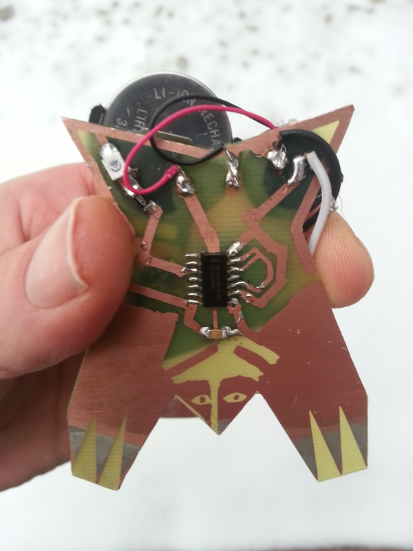
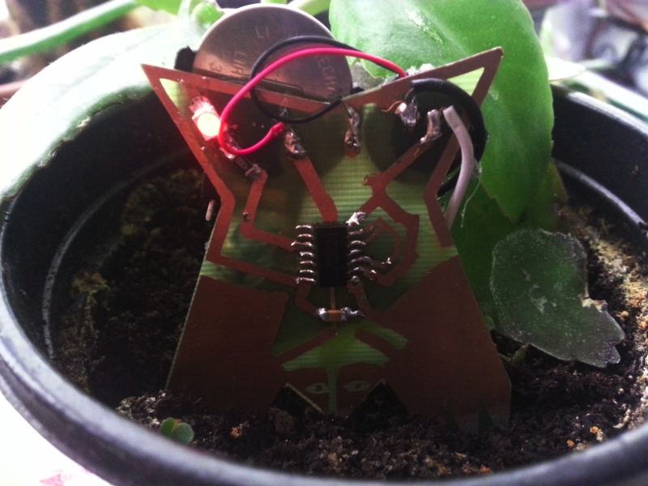
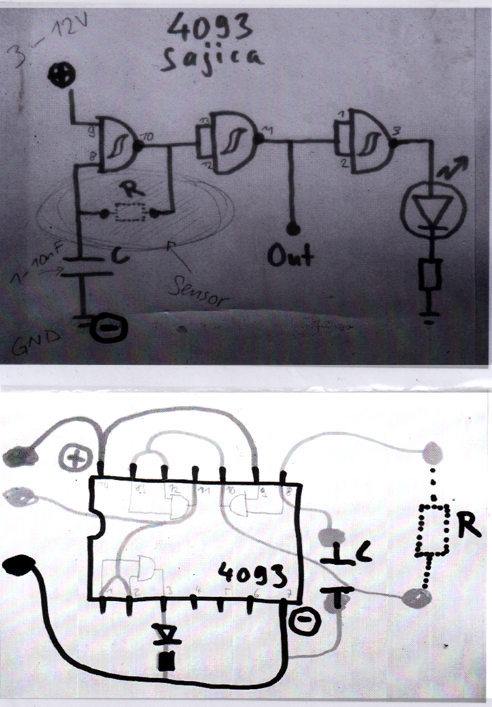

# Maulwurf

A mole made using Marc Dusseiller's [DIY CAD method](https://www.hackteria.org/wiki/Diy-CAD). The circuit is a little oscillator using a CD4093 quad nand-gate and a piezo buzzer. Touch the mole's hands (or underside in the 2 layer version) or stick it into the ground to change the sound and get the LED to blink.

To see a preview of the board and buy the parts go to the [Kitspace page](https://kitspace.org/boards/github.com/kasbah/maulwurf/). Send the Gerbers to any PCB batching service to make your own. The top copper is also _home_ etchable and the circuit works without any of the other layers.

